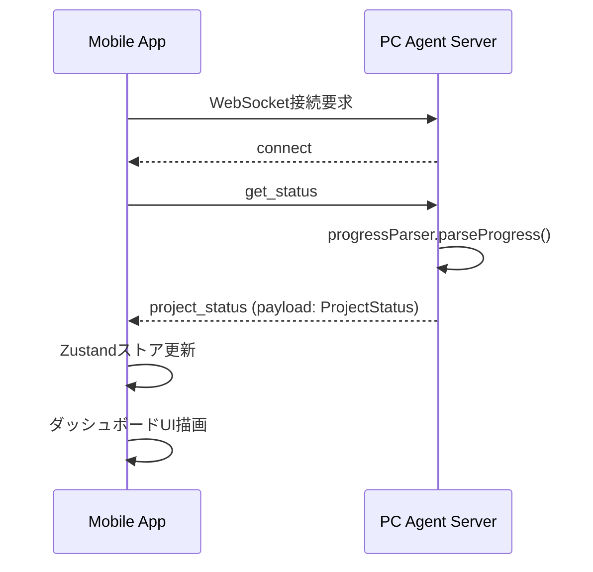
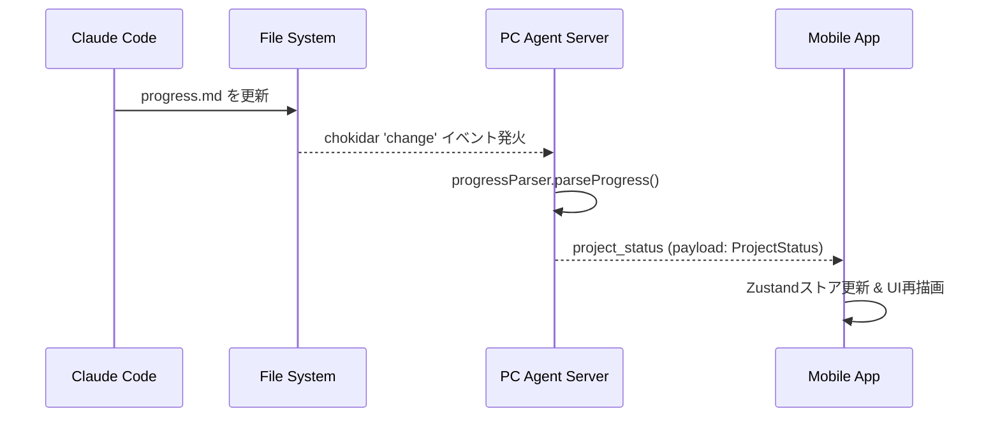

# Remote Cursor - API Specification

**バージョン**: 1.0  
**作成日**: 2025年1月1日  
**作成者**: Manus AI

---

## 1. 概要

本ドキュメントは、Remote Cursorアプリケーションのサーバー（PC Agent Server）とクライアント（Mobile App）間の通信インターフェースを定義します。通信は主にWebSocket（Socket.io）を使用し、一部の補助的な機能にREST APIを使用します。

## 2. 通信プロトコル

- **プライマリ**: WebSocket (Socket.io 4.x)
- **セカンダリ**: REST (HTTP/1.1)

## 3. WebSocket API

リアルタイムな双方向通信のすべてを担います。

### 3.1. 接続

クライアントはサーバーのルートエンドポイントに接続します。

```
URL: ws://<server_address>:<port>
```

### 3.2. サーバーからクライアントへのイベント (S2C)

| イベント名 | ペイロード | 説明 |
|:---|:---|:---|
| `connect` | - | クライアントの接続成功時にSocket.ioから自動発行されます。 |
| `disconnect` | `reason: string` | 接続が切断された際に発行されます。 |
| `project_status` | `ProjectStatus` | プロジェクト全体の最新状態を送信します。接続時および`progress.md`変更時に発行されます。 |
| `task_update` | `Task` | 特定のタスクの状態が更新された際に発行されます（詳細なリアルタイム更新用）。 |
| `blocker_alert` | `Blocker` | 新しいブロッカーが検知された際に発行されます。プッシュ通知のトリガーとなります。 |
| `log_entry` | `ActivityLogEntry` | 新しいログエントリが発生した際にリアルタイムでストリーミングします。 |
| `instruction_response` | `{ success: boolean; message: string; }` | クライアントからの`send_instruction`イベントに対する応答です。 |

*ペイロードの型は `@common/types.ts` を参照してください。*

### 3.3. クライアントからサーバーへのイベント (C2S)

| イベント名 | ペイロード | 説明 |
|:---|:---|:---|
| `get_status` | - | 接続直後にクライアントが発行し、最新の`project_status`を要求します。 |
| `send_instruction` | `{ instruction: string; context?: any; }` | ブロッカー解決指示など、ユーザーからの操作をサーバーに送信します。`context`にはブロッカーIDなどが含まれます。 |

### 3.4. 通信シーケンス例

#### アプリ起動と初期表示



#### `progress.md` 更新



## 4. REST API

主にヘルスチェックや、WebSocketが利用できない場合のフォールバックとして使用します。

### 4.1. エンドポイント一覧

| メソッド | パス | 説明 |
|:---|:---|:---|
| `GET` | `/api/health` | サーバーの死活監視を行います。 |
| `GET` | `/api/status` | 現在のプロジェクトステータスを取得します。`get_status`イベントのREST版です。 |

### 4.2. エンドポイント詳細

#### `GET /api/health`

- **説明**: サーバーが正常に動作しているかを確認します。
- **リクエスト**: なし
- **レスポンス (200 OK)**:
  ```json
  {
    "status": "ok",
    "timestamp": "2025-01-01T12:00:00.000Z"
  }
  ```

#### `GET /api/status`

- **説明**: 最新のプロジェクトステータスをJSON形式で取得します。
- **リクエスト**: なし
- **レスポンス (200 OK)**:
  - `ProjectStatus` オブジェクト (`@common/types.ts` 参照)
  ```json
  {
    "lastUpdated": "2025-01-01T12:00:00.000Z",
    "tracks": [ ... ],
    "blockers": [ ... ],
    "overallStatus": "In Progress",
    "completedTasks": 5,
    "totalTasks": 12
  }
  ```

## 5. エラーハンドリング

### 5.1. WebSocket

- `instruction_response` イベントの `success: false` でエラーを通知します。

  ```json
  {
    "success": false,
    "message": "Failed to create task file: Permission denied."
  }
  ```

### 5.2. REST API

- 標準的なHTTPステータスコードを使用します。
- エラーレスポンスのボディは以下の形式とします。

  ```json
  {
    "error": {
      "code": "INTERNAL_SERVER_ERROR",
      "message": "Failed to parse progress.md."
    }
  }
  ```

| ステータスコード | `code` | 説明 |
|:---|:---|:---|
| 400 | `BAD_REQUEST` | リクエスト形式が不正です。 |
| 404 | `NOT_FOUND` | リソースが見つかりません。 |
| 500 | `INTERNAL_SERVER_ERROR` | サーバー内部でエラーが発生しました。 |

---

## 6. 将来の拡張

- **認証**: `Authorization` ヘッダーや接続時のトークンを利用した認証機構の追加を検討します。
- **REST APIの拡充**: タスクの個別取得や更新など、より詳細な操作のためのエンドポイントを追加する可能性があります。
