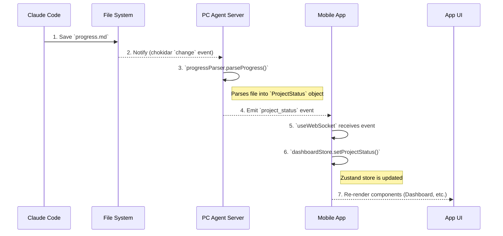
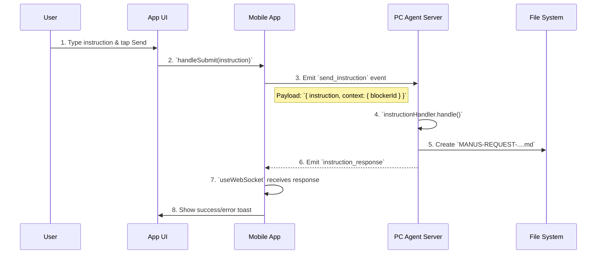
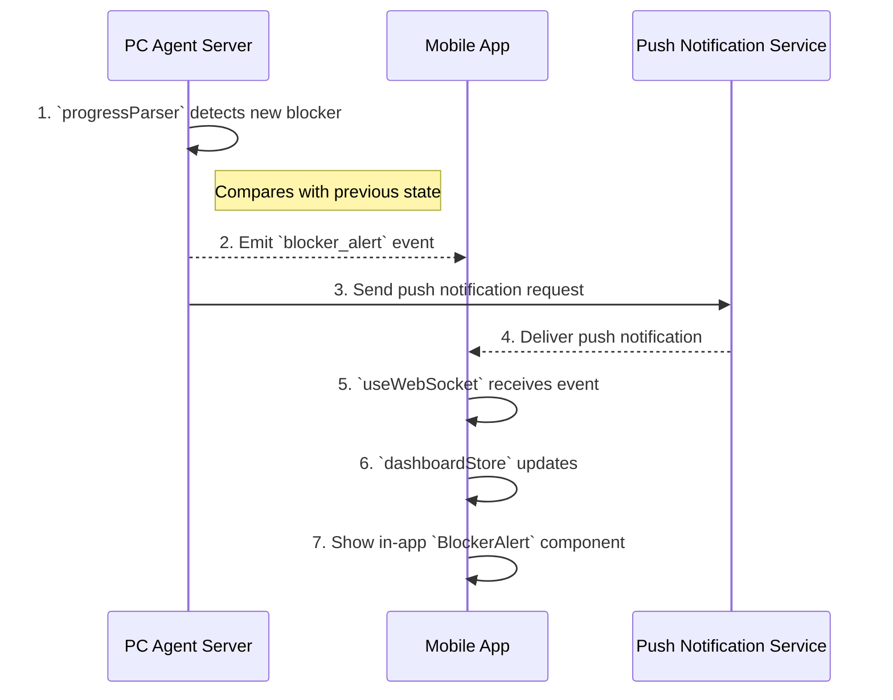
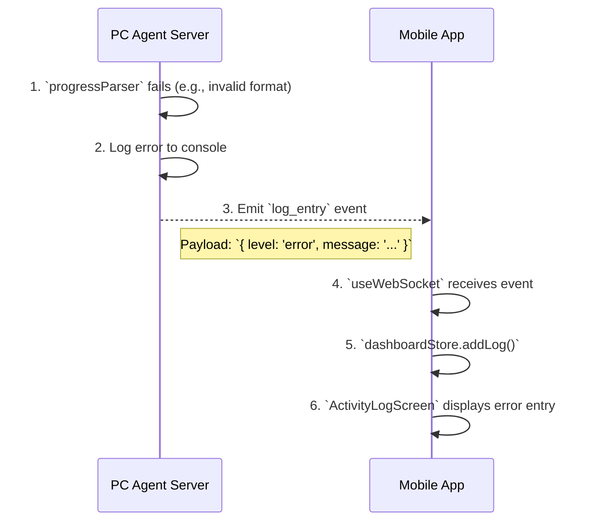

# Remote Cursor - Data Flow Design

**Version**: 1.0  
**Date**: 2025-01-01  
**Author**: Manus AI

---

## 1. Overview

This document illustrates the primary data flows within the Remote Cursor application. It visualizes how data moves from its origin (e.g., a file change, a user action) through the system to its destination (e.g., a UI update, a generated file).

## 2. Core Data Flows

### 2.1. Real-time Progress Update Flow

This is the primary data flow for monitoring project progress.

**Trigger**: A Claude Code instance modifies the `progress.md` file.

| Step | Actor | Action | Data Transformed |
|:---|:---|:---|:---|
| 1-2 | File System | File change event | `progress.md` content -> Raw buffer |
| 3 | Server | Parse Markdown | Raw buffer -> `ProjectStatus` JSON object |
| 4 | Server | WebSocket emit | `ProjectStatus` JSON -> WebSocket frame |
| 5-6 | Client | State update | WebSocket frame -> Zustand state object |
| 7 | Client (React) | UI render | Zustand state -> Rendered UI components |

### 2.2. User Instruction Flow

This flow describes how a user sends an instruction (e.g., to resolve a blocker) from the mobile app.

**Trigger**: User taps the "Send Instruction" button in the `ResolveBlockerForm`.

| Step | Actor | Action | Data Transformed |
|:---|:---|:---|:---|
| 1-2 | Client (UI) | Form submission | User input (string) -> Form state |
| 3 | Client | WebSocket emit | Form state -> `send_instruction` payload |
| 4-5 | Server | File creation | Payload -> Formatted Markdown file |
| 6 | Server | WebSocket emit | Result object -> `instruction_response` payload |
| 7-8 | Client | UI feedback | Payload -> Toast message |

### 2.3. Blocker Detection and Notification Flow

This flow describes how the system detects a new blocker and notifies the user.

**Trigger**: `progress.md` is updated with a new blocker entry.

## 3. Error Handling Flow

This flow describes how a server-side error during parsing is propagated to the client.

## 4. Data Synchronization Strategy

- **On Connect**: The client always requests the full `project_status` upon connecting to ensure it has the latest state.
- **Real-time**: After the initial sync, the server pushes incremental updates (`task_update`, `log_entry`) and full status updates (`project_status`) when major changes occur.
- **State Reconciliation**: The client-side state management is designed to be idempotent. Receiving a full `project_status` object will simply overwrite the existing state, ensuring eventual consistency even if some incremental updates are missed.
