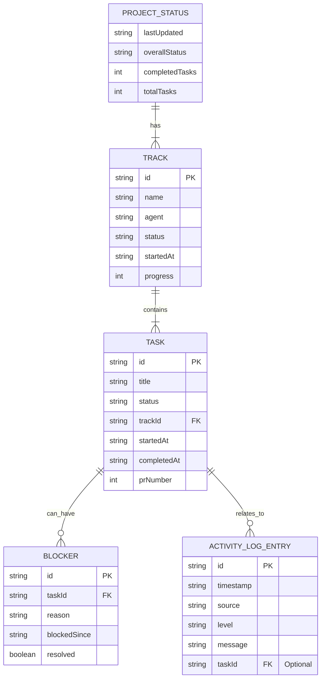

# Remote Cursor - Data Model Specification

**バージョン**: 1.0  
**作成日**: 2025年1月1日  
**作成者**: Manus AI

---

## 1. 概要

本ドキュメントは、Remote Cursorアプリケーション全体で共有されるデータモデルの詳細仕様を定義します。これらのモデルは、サーバーとクライアント間の通信、クライアントの状態管理、および `progress.md` のパース結果の構造化に使用されます。

すべての型定義は `src/common/types.ts` に実装されます。

## 2. データモデル図 (ER図)

主要なデータモデル間の関係性を以下に示します。

## 3. 型エイリアスとEnum

特定の文字列リテラルを型エイリアスとして定義し、一貫性を保ちます。

| 型エイリアス | 許容値 | 説明 |
|:---|:---|:---|
| `TaskStatus` | `'done'`, `'in_progress'`, `'not_started'`, `'blocked'` | タスクのステータス |
| `TrackStatus` | `'active'`, `'paused'`, `'completed'` | トラックのステータス |
| `LogLevel` | `'info'`, `'warning'`, `'error'`, `'success'` | ログエントリのレベル |

## 4. インターフェース詳細

### 4.1. `ProjectStatus`

プロジェクト全体のサマリー状態を表します。主にサーバーからクライアントへ送信されます。

| プロパティ | 型 | 説明 | 必須 | 例 |
|:---|:---|:---|:---:|:---|
| `lastUpdated` | `string` | 最終更新時刻 (ISO 8601) | ✅ | `'2025-01-01T12:00:00.000Z'` |
| `tracks` | `Track[]` | プロジェクトに含まれるトラックの配列 | ✅ | `[ ... ]` |
| `blockers` | `Blocker[]` | 現在アクティブなブロッカーの配列 | ✅ | `[ ... ]` |
| `overallStatus` | `string` | プロジェクト全体のステータス | ✅ | `'In Progress'` |
| `completedTasks`| `number` | 完了したタスクの総数 | ✅ | `5` |
| `totalTasks` | `number` | プロジェクト全体のタスク総数 | ✅ | `12` |

### 4.2. `Track`

`mobile-app`や`server`などの並行開発トラックを表します。

| プロパティ | 型 | 説明 | 必須 | 例 |
|:---|:---|:---|:---:|:---|
| `id` | `string` | トラックの一意なID | ✅ | `'mobile-app'` |
| `name` | `string` | 表示用のトラック名 | ✅ | `'Mobile App'` |
| `agent` | `string` | 担当エージェント名 | ✅ | `'Claude-1'` |
| `status` | `TrackStatus` | トラックの現在のステータス | ✅ | `'active'` |
| `startedAt` | `string` | トラックの開始日時 (ISO 8601) | ✅ | `'2024-12-31T09:00:00.000Z'` |
| `progress` | `number` | 進捗率 (0-100) | ✅ | `45` |
| `completedTasks`| `number` | このトラック内の完了タスク数 | ✅ | `2` |
| `totalTasks` | `number` | このトラック内の総タスク数 | ✅ | `5` |
| `tasks` | `Task[]` | このトラックに属するタスクの配列 | ✅ | `[ ... ]` |

### 4.3. `Task`

`TASK-XXX`形式で管理される個別のタスクを表します。

| プロパティ | 型 | 説明 | 必須 | 例 |
|:---|:---|:---|:---:|:---|
| `id` | `string` | タスクの一意なID | ✅ | `'TASK-010'` |
| `title` | `string` | タスクのタイトル | ✅ | `'共有データモデルの定義'` |
| `status` | `TaskStatus` | タスクの現在のステータス | ✅ | `'in_progress'` |
| `trackId` | `string` | 所属するトラックのID | ✅ | `'common'` |
| `startedAt` | `string` | タスクの開始日時 (ISO 8601) | ❌ | `'2025-01-01T10:00:00.000Z'` |
| `completedAt` | `string` | タスクの完了日時 (ISO 8601) | ❌ | `'2025-01-01T11:30:00.000Z'` |
| `duration` | `number` | 所要時間（分） | ❌ | `90` |
| `prNumber` | `number` | 関連するPull Requestの番号 | ❌ | `25` |
| `prUrl` | `string` | 関連するPull RequestのURL | ❌ | `'https://github.com/...'` |
| `activityLog` | `ActivityLogEntry[]` | このタスクに関連するログ | ❌ | `[ ... ]` |

### 4.4. `Blocker`

タスクの進行を妨げている障害を表します。

| プロパティ | 型 | 説明 | 必須 | 例 |
|:---|:---|:---|:---:|:---|
| `id` | `string` | ブロッカーの一意なID | ✅ | `'BLK-001'` |
| `taskId` | `string` | ブロックされているタスクのID | ✅ | `'TASK-011'` |
| `reason` | `string` | ブロッカーの理由 | ✅ | `'API specification is unclear.'` |
| `blockedSince`| `string` | ブロックが開始された日時 (ISO 8601) | ✅ | `'2025-01-01T14:00:00.000Z'` |
| `impactedTasks`| `string[]` | このブロッカーにより影響を受ける下流タスクのID配列 | ✅ | `['TASK-013']` |
| `resolved` | `boolean` | 解決済みかどうか | ✅ | `false` |
| `resolvedAt` | `string` | 解決された日時 (ISO 8601) | ❌ | `null` |

### 4.5. `ActivityLogEntry`

リアルタイムでストリーミングされるログの単一エントリを表します。

| プロパティ | 型 | 説明 | 必須 | 例 |
|:---|:---|:---|:---:|:---|
| `id` | `string` | ログエントリの一意なID | ✅ | `'log-1672574400000'` |
| `timestamp` | `string` | ログの発生日時 (ISO 8601) | ✅ | `'2025-01-01T12:00:00.000Z'` |
| `source` | `string` | ログの発生源 | ✅ | `'claude-1'` |
| `level` | `LogLevel` | ログの重要度レベル | ✅ | `'info'` |
| `message` | `string` | ログのメッセージ本文 | ✅ | `'Starting task TASK-010...'` |
| `taskId` | `string` | 関連するタスクのID | ❌ | `'TASK-010'` |
| `metadata` | `Record<string, any>` | 追加のメタデータ | ❌ | `{ "file": "types.ts" }` |

## 5. バリデーションルール

- **ID**: すべての `id` は空でない文字列である必要があります。
- **日時**: すべての日時文字列は有効なISO 8601形式である必要があります。
- **進捗率**: `progress` は0から100の間の数値である必要があります。
- **ステータス**: 各ステータスプロパティは、定義された型エイリアスのいずれかの値を持つ必要があります。

これらのバリデーションは、主に `progressParser.ts` でのパース時と、API経由でデータを受信した際に保証されるべきです。
