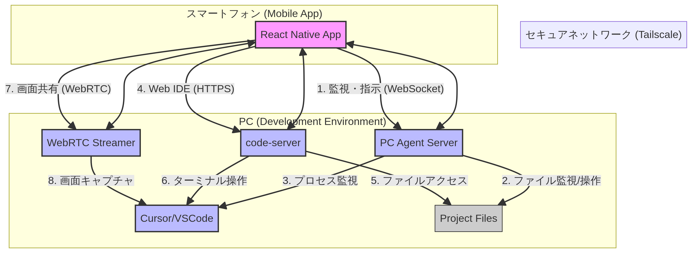

# 「Remote Cursor」アプリケーション 技術アーキテクチャ設計書

## 1. はじめに

本ドキュメントは、「Remote Cursor」アプリケーションの技術アーキテクチャを定義する。要件定義書に基づき、システムの全体像、コンポーネント、技術スタック、およびデータフローを明確にすることを目的とする。

## 2. アーキテクチャ概要

本システムは、スマートフォン上で動作する「モバイルアプリ」と、PC上で動作する複数の「サーバーコンポーネント」から構成される。両者は**Tailscale**によるセキュアなP2Pネットワークを介して通信し、外部に機密情報を漏らすことなく安全なリモート操作を実現する。

アーキテクチャの基本方針は、リサーチ結果で結論付けた**ハイブリッド型アプローチ**を採用する。

- **監視・通知**: 軽量なカスタムサーバーとWebSocketでリアルタイム性を確保。
- **コア開発**: `code-server`を利用し、Web技術で高機能なIDE体験を提供。
- **補助機能**: WebRTCによるオンデマンドの画面共有で、`code-server`がカバーできない領域を補完。

### 2.1. アーキテクチャ図

## 3. コンポーネント詳細

### 3.1. モバイルアプリ (React Native App)

- **技術スタック**: React Native (Expo), TypeScript
- **役割**:
    - ユーザーインターフェースの提供（監視ダッシュボード、設定画面など）。
    - PC Agent ServerとのWebSocket接続を確立し、リアルタイムな情報（ログ、ファイル変更など）を受信・表示する。
    - ユーザーからの指示をPC Agent Serverに送信する。
    - アプリ内Webビュー（WebView）を介して`code-server`のフロントエンドを表示・操作する。
    - WebRTC経由でPC画面のストリーミング映像を受信・表示する。

### 3.2. PC Agent Server

- **技術スタック**: Node.js (Express, ws), TypeScript
- **役割**:
    - モバイルアプリからのWebSocket接続を受け付けるエンドポイント。
    - ファイルシステム（`progress.md`など）の変更を監視し、変更内容をWebSocketでアプリに通知する（`chokidar`等を利用）。
    - アプリからの指示（例：タスクファイルの作成）を受け、ファイルシステムを操作する。
    - Cursor/VSCodeのプロセス状態を監視し、異常を検知した際に通知する。
    - 定型コマンド（テスト実行、ビルド等）を実行するためのAPIエンドポイントを提供する。

### 3.3. code-server

- **技術スタック**: code-server (Standalone VSCode)
- **役割**:
    - VSCode環境をWebサービスとしてPC上で実行する。
    - モバイルアプリのWebビューからのHTTPSリクエストを受け付け、VSCodeのUIを提供する。
    - ファイルアクセス、ターミナル操作、デバッグなど、VSCodeのコア機能を提供する。

### 3.4. WebRTC Streamer

- **技術スタック**: Node.js, WebRTC (e.g., `node-webrtc`, `werift`)
- **役割**:
    - モバイルアプリからの要求に応じて、PCのデスクトップ画面（または特定のウィンドウ）のキャプチャを開始する。
    - キャプチャした映像をWebRTCプロトコルでエンコードし、Tailscaleネットワーク経由でモバイルアプリにストリーミング配信する。
    - シグナリングサーバーとして機能し、モバイルアプリとのP2P接続を確立する。

### 3.5. セキュアネットワーク (Tailscale)

- **技術スタック**: Tailscale
- **役割**:
    - スマートフォンとPC間に、エンドツーエンドで暗号化されたセキュアなP2Pメッシュネットワークを構築する。
    - すべてのコンポーネント間通信（WebSocket, HTTPS, WebRTC）は、このTailscaleネットワーク上で行われる。
    - MagicDNS機能により、固定のホスト名で各サービスにアクセスできるようにする。

## 4. データフロー

### 4.1. 監視フロー

1. PC上の`PC Agent Server`が、プロジェクトファイルの変更を監視する。
2. ファイルが変更されると、サーバーはWebSocketを通じてモバイルアプリに通知を送信する。
3. モバイルアプリは通知を受け取り、ダッシュボードの表示を更新する。

### 4.2. Web IDE操作フロー

1. ユーザーがモバイルアプリで「Web IDEを開く」をタップする。
2. アプリ内のWebビューが、Tailscale経由でPC上の`code-server`のURLを開く。
3. ユーザーはWebビュー内でコード編集やターミナル操作を行う。
4. `code-server`はPCのファイルシステムやターミナルと直接やり取りする。

### 4.3. 画面共有フロー

1. ユーザーがモバイルアプリで「画面共有を開始」をタップする。
2. モバイルアプリが`WebRTC Streamer`にP2P接続を要求する（シグナリング）。
3. `WebRTC Streamer`がPC画面のキャプチャを開始し、ストリーミングを開始する。
4. モバイルアプリがストリーミング映像を受信し、画面に表示する。

## 5. 技術選定理由

- **React Native (Expo)**: iOS/Androidのクロスプラットフォーム開発を効率的に行え、豊富なライブラリ（Webビュー、WebSocketクライアント等）が利用可能。
- **Node.js/TypeScript**: PC側のサーバーコンポーネントを、フロントエンドと共通の言語で効率的に開発できる。非同期処理に強く、WebSocketやファイル監視との相性が良い。
- **Tailscale**: 複雑なネットワーク設定を不要にし、ゼロコンフィグで高いセキュリティを実現できるため、本プロジェクトの根幹技術として最適。
- **code-server**: 最も成熟したWeb IDEソリューションであり、VSCodeの豊富なエコシステムをそのまま活用できる。
- **WebRTC**: P2Pによる低遅延なストリーミングを実現するための標準技術であり、オンデマンドの画面共有に最適。
