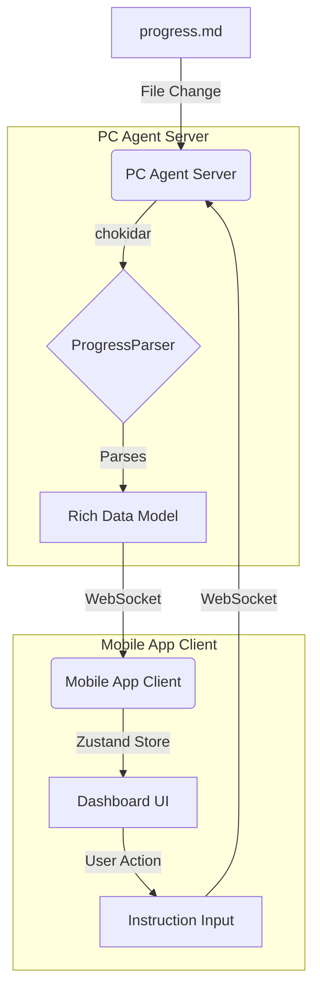

# Remote Cursor UI/UX Overhaul - Implementation Plan

**バージョン**: 1.0  
**作成日**: 2025年12月31日  
**作成者**: Manus AI

---

## 1. はじめに

本ドキュメントは、Remote CursorアプリケーションのUI/UXをワイヤーフレームで定義された理想形に刷新するための詳細な実装計画を定義します。現在の実装と理想形との間のギャップを埋め、Manus-Claude Codeワークフローに特化した高度な監視体験を実現することを目的とします。

参照資料:
- [UI/UXワイヤーフレーム仕様書](./WIREFRAME_SPEC.md)
- [ギャップ分析レポート](./GAP_ANALYSIS.md)

---

## 2. アーキテクチャ概要

UI/UX刷新後のアーキテクチャは、サーバーとクライアント間でよりリッチなデータをリアルタイムに同期するモデルへと進化します。

---

## 3. データモデルの再設計

サーバーとクライアント間で一貫したデータ構造を確保するため、共有データモデルを定義します。このモデルは、`progress.md`からパースされる情報の完全な表現となります。

| モデル | 説明 | 主なプロパティ |
|:---|:---|:---|
| **Track** | `mobile-app`や`server`などの開発トラック | `id`, `name`, `agent`, `status`, `progress`, `tasks` |
| **Task** | `TASK-XXX`形式の個別タスク | `id`, `title`, `status`, `duration`, `prNumber`, `activityLog` |
| **Blocker** | 作業を妨げている障害 | `id`, `taskId`, `reason`, `blockedSince`, `resolved` |
| **ActivityLogEntry** | リアルタイムログのエントリ | `id`, `timestamp`, `source`, `level`, `message` |

*詳細な型定義は `src/common/types.ts` に実装します。*

---

## 4. 実装フェーズとエピック

実装は以下の4つのフェーズ、12のエピックに分割して進めます。

### Phase 1: 基盤整備とデータ層

**目的**: 新しいUIを支えるためのデータモデルと状態管理の基盤を構築します。

- **EPIC-01: 共有データモデルの定義**
  - `src/common/types.ts`を作成し、Track, Task, Blocker, ActivityLogEntryの型を定義します。
- **EPIC-02: サーバーサイドパーサーの強化**
  - `progressParser.ts`を更新し、新しい共有データモデルに準拠したリッチなJSONを出力するようにします。
- **EPIC-03: モバイルアプリ状態管理の刷新**
  - Zustandストア（`dashboardStore.ts`）を拡張し、Tracks, Tasks, Blockersを正規化して管理するようにします。

### Phase 2: ダッシュボードUIの刷新

**目的**: アプリのメイン画面であるダッシュボードをワイヤーフレーム通りに刷新します。

- **EPIC-04: ダッシュボード画面の再構築**
  - `DashboardScreen.tsx`をリファクタリングし、新しいコンポーネントを配置します。
- **EPIC-05: 新規ダッシュボードコンポーネントの実装**
  - `ProgressSummaryCard.tsx`
  - `TrackCard.tsx`
  - `BlockerAlert.tsx`

### Phase 3: 新規画面とナビゲーション

**目的**: トラック詳細、ブロッカー詳細、アクティビティログの各画面を新規に作成します。

- **EPIC-06: ナビゲーションのセットアップ**
  - React Navigationに新しい画面を追加し、型定義を更新します。
- **EPIC-07: トラック詳細画面の実装**
  - `TrackDetailScreen.tsx`と関連コンポーネント（`TrackInfoCard`, `TaskTimeline`）を作成します。
- **EPIC-08: ブロッカー詳細画面の実装**
  - `BlockerDetailScreen.tsx`と関連コンポーネント（`BlockerCard`, `ResolveBlockerForm`）を作成します。
- **EPIC-09: アクティビティログ画面の実装**
  - `ActivityLogScreen.tsx`と関連コンポーネント（`FilterChips`, `LogEntry`拡張）を作成します。

### Phase 4: リアルタイム機能と仕上げ

**目的**: アプリケーションの動的な側面を強化し、完成度を高めます。

- **EPIC-10: WebSocket通信の強化**
  - `project_status`以外の新しいイベント（`task_update`, `blocker_alert`, `log_entry`）を処理するロジックを追加します。
- **EPIC-11: プッシュ通知の実装**
  - Expo Push Notificationsを導入し、ブロッカー発生時に通知を送信する機能を実装します。
- **EPIC-12: ドキュメントとクリーンアップ**
  - README、コンポーネントドキュメントを更新し、不要なコードを削除します。

---

## 5. 技術スタック

| カテゴリ | 技術 | 備考 |
|:---|:---|:---|
| **フロントエンド** | React Native, Expo, TypeScript | 変更なし |
| **UIライブラリ** | NativeWind | 変更なし |
| **状態管理** | Zustand | 既存のストアを拡張 |
| **ナビゲーション** | React Navigation | 新規画面を追加 |
| **バックエンド** | Node.js, Express, Socket.io | 変更なし |
| **ファイル監視** | Chokidar | 変更なし |
| **テスト** | Jest, React Testing Library | 新規コンポーネントのテスト追加 |

---

## 6. 次のステップ

本計画に基づき、各エピックを具体的なタスクファイル（`TASK-XXX.md`）に分割し、Claude Codeによる実装を開始します。
