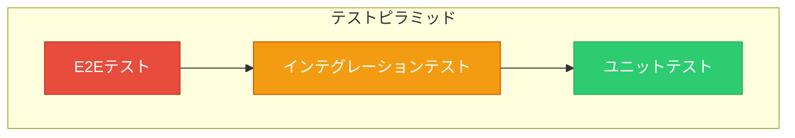

# Remote Cursor - Test Plan

**バージョン**: 1.0  
**作成日**: 2025年1月1日  
**作成者**: Manus AI

---

## 1. 概要

本ドキュメントは、Remote Cursor Sprint 2（UI/UX刷新）における品質保証活動の全体計画を定義します。テスト戦略、範囲、手法、および目標を明確にすることで、高品質なアプリケーションをリリースすることを目的とします。

## 2. テスト戦略

「テストピラミッド」モデルに基づき、各レイヤーでバランスの取れたテストを実装します。

| テストレベル | 割合 | 目的 | ツール |
|:---|:---:|:---|:---|
| **ユニットテスト** | 70% | 個々の関数、コンポーネント、クラスのロジックを検証する | Jest, React Testing Library |
| **インテグレーションテスト** | 20% | 複数コンポーネント、クライアント-サーバー間の連携を検証する | Jest, Mock Service Worker |
| **E2Eテスト** | 10% | ユーザー視点で主要なワークフロー全体を検証する | Appium, Detox (検討) |

## 3. テスト範囲

### 3.1. 対象範囲

- **サーバーサイド (PC Agent Server)**
  - `progressParser` のパースロジック
  - WebSocketイベントの送受信
  - REST APIエンドポイント
- **クライアントサイド (Mobile App)**
  - UIコンポーネントのレンダリングとインタラクション
  - Zustandストアの状態更新ロジック
  - WebSocketイベントのハンドリング
  - ナビゲーション

### 3.2. 対象外範囲

- サードパーティライブラリ自体の内部ロジック（例: `react-native-circular-progress`）
- OSやハードウェアに依存する特定の不具合
- パフォーマンステスト、ストレステスト（本計画では対象外とし、別途計画）

## 4. テストレベル詳細

### 4.1. ユニットテスト

- **目標**: コードカバレッジ **80%** 以上を目指す。
- **対象**:
  - **サーバー**: `progressParser.ts` の各抽出関数。
  - **クライアント**: UIコンポーネントのPropsに応じた表示の検証、Zustandストアのアクションとセレクターの検証。
- **実行タイミング**: `git commit` 時のpre-commitフック、およびCIパイプライン。

### 4.2. インテグレーションテスト

- **目標**: 主要なクライアント-サーバー間の通信シナリオをカバーする。
- **対象**:
  - **WebSocket通信**: Mock Service Worker (MSW) やモックサーバーを用いて、クライアントがサーバーからのイベント (`project_status` など) を正しく処理し、状態を更新することを検証する。
  - **コンポーネント連携**: `DashboardScreen` が `TrackCard` や `BlockerAlert` と連携し、全体のUIが正しく構築されることを検証する。
- **実行タイミング**: Pull Request作成時、およびCIパイプライン。

### 4.3. E2E (End-to-End) テスト

- **目標**: 主要なユーザーストーリー（クリティカルパス）が正常に完了することを確認する。
- **対象シナリオ**:
  1. **正常系: リアルタイム更新**
     - アプリ起動 → サーバー接続 → ダッシュボード表示 → `progress.md` 更新 → ダッシュボードのリアルタイム反映
  2. **正常系: 指示送信**
     - ブロッカー発生 → BlockerAlert表示 → 詳細画面へ遷移 → 指示入力 → 送信 → `MANUS-REQUEST` ファイル生成
  3. **異常系: サーバー切断**
     - アプリ利用中にサーバーが切断 → 接続ステータスが「disconnected」に変化 → 再接続試行
- **ツール**: AppiumまたはDetoxを検討。まずは手動テストから開始し、将来的に自動化を目指す。
- **実行タイミング**: リリース候補ビルド作成時。

## 5. テスト環境

| 環境 | 目的 | サーバー | クライアント |
|:---|:---|:---|:---|
| **ローカル開発環境** | ユニット/インテグレーションテスト | `npm test` | `npm test` |
| **CI環境** | 自動テスト実行 | GitHub Actions | GitHub Actions |
| **ステージング環境** | E2Eテスト、手動確認 | Dockerコンテナ | Expo Go / TestFlight |
| **本番環境** | - | - | App Store / Play Store |

## 6. バグ管理

- **バグトラッキング**: GitHub Issuesを使用する。
- **優先度定義**:
  - `P0 (Critical)`: クラッシュ、データ損失、主要機能の完全な不全
  - `P1 (High)`: 主要機能の重大な不具合、UIの著しい崩れ
  - `P2 (Medium)`: 一般的な機能不具合、UIの軽微な問題
  - `P3 (Low)`: タイプミス、見た目の微調整
- **バグ報告テンプレート**: Issueテンプレートを定義し、再現手順、期待される結果、実際の結果、スクリーンショット/動画を含めることを必須とする。

## 7. リリース判定基準

以下の条件をすべて満たした場合にリリースを承認する。

- ユニットテストおよびインテグレーションテストがすべてパスすること。
- コードカバレッジが目標値（80%）を達成していること。
- E2Eテストの主要シナリオがすべて成功すること。
- `P0`, `P1` の優先度のバグが0件であること。
- `P2` の優先度のバグが3件以下であること。

---

## 8. 役割と責任

| 役割 | 担当 | 責任 |
|:---|:---|:---|
| **開発者 (Claude Code)** | Claude-1, Claude-2 | ユニット/インテグレーションテストの実装 |
| **QAエンジニア (Manus)** | Manus AI | テスト計画の策定、E2Eテストの実施、バグ管理、リリース判定 |
| **プロダクトオーナー (User)** | User | 受け入れテストの実施、最終承認 |
